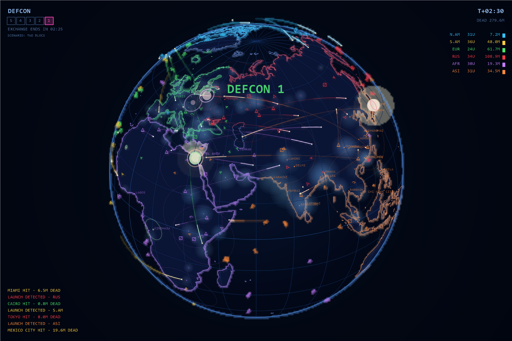
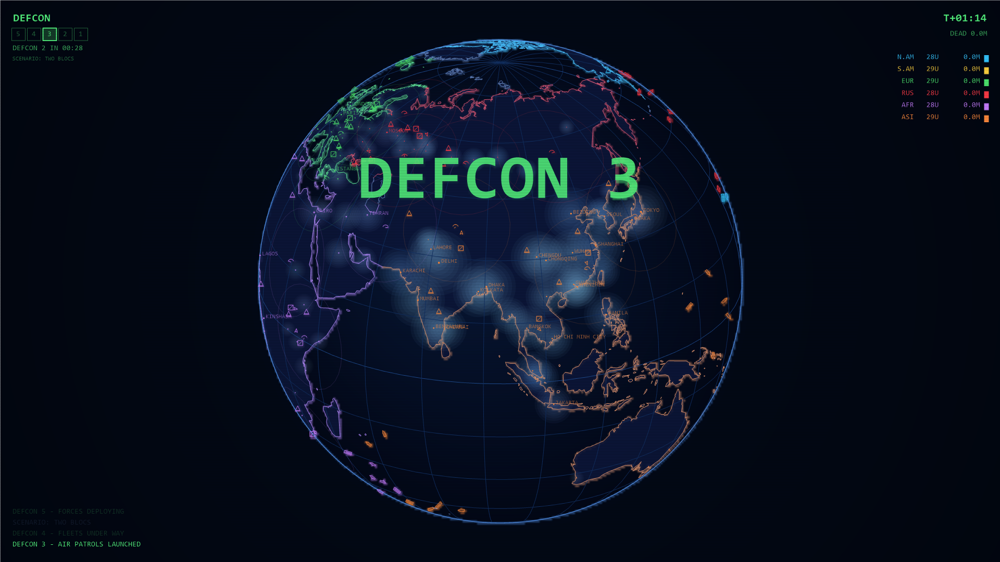
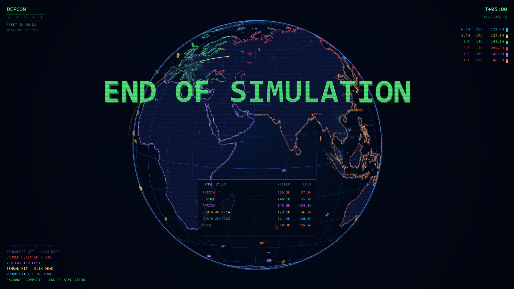
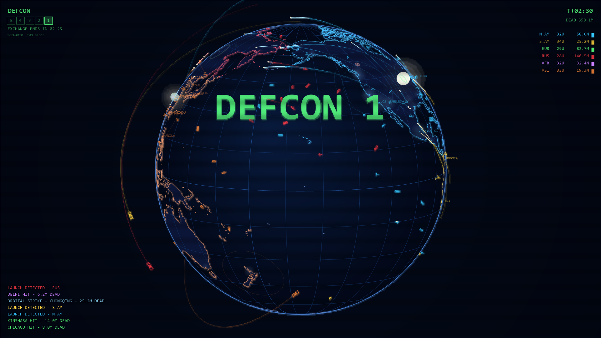
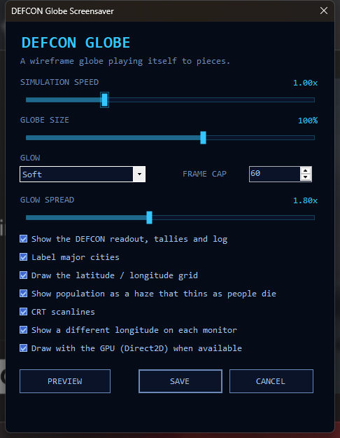
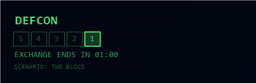
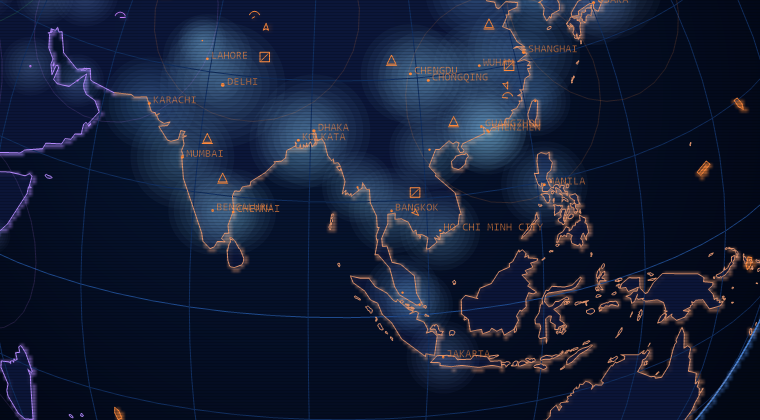

# DEFCON Globe Screensaver

A Windows screensaver in the style of Introversion Software's *DEFCON* (2006), and of the
Mac-only DEFCON Globe screensaver that Ambrosia shipped alongside it. A vector globe turns
slowly against near-black space while six blocs fight a full nuclear exchange on it: fleets
put to sea, radar sweeps, bombers scramble, and at DEFCON 1 the missiles fly.



Nothing here is Introversion's code or art — it is an original build that borrows the look.

## What it does

A complete war runs in about five and a half minutes, then resets with a fresh scenario:

| Phase | Roughly | What happens |
|---|---|---|
| DEFCON 5 | 42 s | Silos, radar and airbases fade in; fleets sail |
| DEFCON 4 | 30 s | Fleets manoeuvre, radar sweeps turn. Surface ships keep below 66 degrees; only submarines work under the ice |
| DEFCON 3 | 30 s | Fighters and bombers launch from airbases |
| DEFCON 2 | 28 s | Weapons free — ships and aircraft start shooting |
| DEFCON 1 | 165 s | Nuclear release: ICBMs, SLBMs, interceptors, cities burn. Hidden orbital platforms unmask and open fire |
| Aftermath | 26 s | "END OF SIMULATION", final tally, then a new world |

Fleets at sea and air patrols up at DEFCON 3, before anything has been fired:



And five and a half minutes later, with the tally up and the map gone quiet:



## Orbital platforms

Not in the original game. At DEFCON 1 each bloc unmasks one or two weapons platforms, already
in orbit and until then hidden. Each rides its own great circle, and the stretch of orbit ahead
of it is drawn so you can see where it is heading. A platform picks a city in the cone beneath
it and fires: a laser does the damage of a warhead, instantly, with the beam visible for a
little over half a second.



The coloured arcs are the stretch of orbit each platform is about to fly through, and the log
records a strike on Chongqing.

Silos shoot back. Roughly one round in six goes to a direct-ascent anti-satellite shot at a
platform high enough above the silo's horizon to be engaged. Those climb out of the atmosphere
under their own guidance and chase the platform to wherever it has moved. Over a typical
exchange that comes to around eight to ten platforms, a couple of dozen laser strikes, and
most of the platforms eventually knocked down.

Each cycle randomises the alliances (two blocs / three pacts / asymmetric / free-for-all),
unit placement and camera. The camera drifts on its own but eases toward wherever the
warheads are landing.

## Requirements

- Windows 10 or 11, x64
- [.NET 8 Desktop Runtime](https://dotnet.microsoft.com/download/dotnet/8.0) to run
- .NET SDK 8 or newer to build
- A Direct2D-capable display driver for the fast path; without one it falls back to software

Build with `-SelfContained` to bundle the runtime and drop the dependency (59 MB instead of 2.4 MB).

## Build

```powershell
.\build.ps1
```

Produces `dist\DefconSaver.scr`, a single 2.4 MB file. Everything is inside it: the
coastline data is an embedded resource and the Direct2D assemblies are bundled, so copying
that one file to another x64 machine with the .NET 8 Desktop Runtime is the whole install.

For a machine without the runtime:

```powershell
.\build.ps1 -SelfContained
```

## Install

```powershell
.\install.ps1
```

Per-user, no administrator rights: it points `HKCU\Control Panel\Desktop\SCRNSAVE.EXE` at the
`.scr` and turns the screensaver on with a five-minute idle delay. Undo with
`.\install.ps1 -Revert`.

Windows' *Screen saver* dropdown only lists `.scr` files in `%SystemRoot%\System32`, which is
why the script sets the value directly. If you would rather have it in the dropdown, copy
`dist\DefconSaver.scr` into `System32` from an elevated prompt.

## Running it by hand

| Command | What it does |
|---|---|
| `DefconSaver.scr /s` | Full screen on every monitor; any key or a mouse nudge exits |
| `DefconSaver.scr /c` | Settings dialog |
| `DefconSaver.scr /w [w h]` | Runs in an ordinary window — handy for a look without locking the screen |
| `DefconSaver.scr /p <hwnd>` | Preview pane (Windows calls this one) |
| `DefconSaver.scr /g <dir> [w h] [camLat] [camLon]` | Dumps ten PNG stills across one scenario, with per-stage frame timings |
| `DefconSaver.scr /x <file> [camLat] [camLon] [px py]` | Writes land-fill geometry diagnostics: which rings sweep the limb, and which ones cover a probe pixel |
| `DefconSaver.scr /b <file> [w h frames]` | Steady-state frame timing with a per-stage breakdown |

Note that PowerShell's `Start-Process` on a `.scr` goes through the shell and ignores your
arguments. Invoke it with the call operator (`& .\dist\DefconSaver.scr /w`) or from `cmd`.

## Settings

Stored under `HKCU\Software\DefconSaver`.

- **Simulation speed** — 0.25x to 3x
- **Globe size** — 60 % to 125 % of the default radius
- **Glow** — Off / Soft (one blur pass) / Full bloom (two). Drop this first if frames are tight
- **Glow spread** — how far the bloom reaches, 0.9x to 3.0x. Strokes in the glow layer sit
  below a pixel at quarter scale, so this is the floor that keeps them visible
- **Frame cap** — 20 to 120 fps; the loop also sheds a glow pass by itself if it cannot keep up
- **HUD**, **city labels**, **lat/lon grid**, **CRT scanlines**
- **A different longitude on each monitor** — on by default, so a multi-monitor setup reads as
  a bank of consoles rather than a mirror
- **Draw with the GPU** — on by default; turn it off to force software rendering
- **Population haze** — a mist over inhabited ground that thins as the people under it die



The readout, green throughout, with the scanlines on:



The haze over south and east Asia at DEFCON 3, while the population is still intact. It burns
off city by city as the warheads land:



## Performance

Two backends draw the same scene. Direct2D is the default and puts it on the GPU; GDI+ is the
software fallback, used when Direct2D will not start or when you turn the GPU off in settings.
`DEFCON_BACKEND` forces either one.

Measured on a 24-core i9-13900K with an RTX 5090, in a window, with the world frozen at
DEFCON 1 so both backends draw an identical scene. Frame cap off, first second discarded:

| Resolution | GDI+ | Direct2D |
|---|---|---|
| 1280 x 720 | 15.98 ms (p95 17.3), 63 fps | 8.33 ms, 120 fps |
| 1920 x 1080 | 29.28 ms (p95 31.5), 34 fps | 8.33 ms, 120 fps |

Read the Direct2D column carefully: 8.33 ms is exactly this display's 120 Hz refresh interval,
and it is identical at both resolutions because the backend is waiting for the screen rather
than for the GPU. Its real cost is somewhere below that, and this harness cannot separate the
two. GDI+ is genuinely render-bound and roughly doubles from 720p to 1080p.

On the software path the glow composite dominates, then the coastlines, then the graticule and
the population haze. If frames are tight, turn the glow down first, then the grid.

Multiple monitors are drawn in parallel on the software path, one task each, so a second screen
costs wall-clock time only if it is slower than the first rather than adding to it. Direct2D
render targets cannot be used that way — `CanDrawOffThread` is false for them — so with the GPU
backend the screens are drawn one after another on the UI thread.

## How it is put together

One file per concern, with the two backends interchangeable behind one interface:

| File | Role |
|---|---|
| `Geo.cs` | Orthographic sphere camera, coastline rings, the land/sea mask |
| `LandFill.cs` | Turns a coastline ring into its screen-space silhouette polygon |
| `Territories.cs` | The six blocs, as prioritised lat/lon boxes |
| `Cities.cs` | ~135 cities with populations; they are the targets and the score |
| `Sim.cs` | Units, missiles, blasts, orbital platforms, the DEFCON clock, the AI |
| `Scene.cs` | Everything drawn, in terms neither backend owns |
| `IDrawTarget.cs` | The drawing operations `Scene` needs, and nothing else |
| `GdiTarget.cs` / `D2DTarget.cs` | The software and GPU implementations of it |
| `Palette.cs` | Faction and interface colours |
| `SaverForm.cs` / `SaverHost.cs` | Windows, input handling, the frame loop |
| `ConfigForm.cs` | The `/c` dialog |
| `Settings.cs` | The registry-backed options |
| `Program.cs` | Entry point, argument parsing and the diagnostic modes |
| `Profile.cs` | Per-stage timings, on only for `/g` and `/b` |

Four details worth knowing if you change things:

- **The readiness readout and its announcements are one colour**, green, including the big
  banner. That banner is drawn twice: once crisp, and once into the glow layer through its own
  font slot, because that layer is a quarter of the size and a full-size font would land four
  times too large there.
- **The glow**, on both backends, is the scene re-drawn into a quarter-size *transparent*
  buffer at half alpha and blended back up. Over a near-black background that reads as additive
  bloom, and it avoids GDI+'s slow colour-matrix path. It is composited only over the box around
  the globe. Because that layer is a quarter scale, a stroke thinner than four pixels lands
  under one pixel in it and disappears — `Scene.Stroke` is the floor that stops that, and the
  glow spread setting scales it.
- **That upscale is the one loop written out by hand.** `Graphics.DrawImage` will do it in a
  line, but its bilinear stretch costs about 7 ns per destination pixel on a single thread,
  which at 1440p was half the frame. `GdiTarget.CompositeGlow` does the same filtering across
  all cores and skips fully transparent pixels, which took it from 14.7 ms to 0.95 ms. Dropping
  to nearest-neighbour instead is cheaper still and looks visibly blocky, so it is not used.
- **Landmasses crossing the horizon** are filled by projecting hidden vertices out onto the limb
  circle, which closes the silhouette without any clipping maths. Orthographic projection is
  two-to-one, though, so this needs two guards, and both of them were bugs first:
  a vertex has to still be near the limb to be kept (one far behind the globe has a meaningless
  azimuth, and keeping it let a coastline wind several times around the edge), and consecutive
  limb vertices are joined by an arc along the edge rather than a chord across the disc.

## Map data

Coastlines come from [Natural Earth](https://www.naturalearthdata.com/) 1:50m land polygons,
public domain. `Assets\land.bin` is a 50 KB binary of 633 rings / 12,209 points, produced by
Douglas-Peucker simplification and 16-bit quantisation of `ne_50m_land.geojson`.

`land.bin` is committed, so building needs nothing else. To regenerate it — a different
simplification tolerance, say — fetch the GeoJSON (the script's header says where) and run:

```powershell
python tools\make_land_bin.py ne_50m_land.geojson Assets\land.bin
```

## Known rough edges

- Missile trails are clipped at the horizon rather than drawn above it, so a warhead vanishes
  as it crosses the limb. Deliberate: it keeps the edge of the globe clean.
- A landmass that is almost entirely behind the globe contributes a thin sliver of fill along
  the limb rather than its true silhouette. At that angle the difference is a pixel or two.
- Inland seas that are holes in a land polygon (the Caspian, for one) are filled as land.
- Bloc boundaries are boxes, so a few places sit on the wrong side of a line — southern Spain
  reads as Africa, Vladivostok as Asia.
- The camera turns at a steady rate and does not follow the fighting. An earlier version aimed
  it at each launch and detonation, which at DEFCON 1 meant a new target several times a second
  and a view that jumped rather than turned.

If the saver ever exits the moment it starts, run it with `DEFCON_TRACE=1` set: it appends the
reason the loop ended to `%TEMP%\DefconSaver.log`. Nine times in ten that is a mouse being
nudged, which is the saver doing its job.

## Environment overrides

Useful when comparing backends or chasing a rendering difference; none are needed in normal use.

| Variable | Effect |
|---|---|
| `DEFCON_BACKEND` | `gdi` or `d2d`, overriding the setting |
| `DEFCON_SEED` | Fixes the scenario seed |
| `DEFCON_FREEZE_AT` | Winds the world to this many seconds and holds it there |
| `DEFCON_FPSLOG` | Writes frame timings to this file on exit |
| `DEFCON_UNCAP` | Ignores the frame cap |
| `DEFCON_TRACE` | Logs why the full-screen loop ended |
| `DEFCON_LAND` | Land fill colour as `r,g,b`, if you want it lighter or deeper |
| `DEFCON_GLOWSTROKE` | Overrides the glow spread setting, for testing |

A fixed seed plus a frozen clock is what makes the two backends render the very same world,
which is the only way to compare them pixel for pixel.

## Licence

GPL-3.0. See [LICENSE](LICENSE).

An unofficial homage. *DEFCON* is Introversion Software's game and trademark, and this project
is not affiliated with, endorsed by, or connected to Introversion in any way. None of their
code, art or data is used here; the globe, the units and the interface were all written from
scratch to evoke the look. The DEFCON Globe screensaver this imitates was Ambrosia's, Mac-only,
and is not the ancestor of any code in this repository.

Third-party components:

- [Vortice.Windows](https://github.com/amerkoleci/Vortice.Windows) (MIT) for the Direct2D bindings
- [Natural Earth](https://www.naturalearthdata.com/) 1:50m land polygons, public domain
